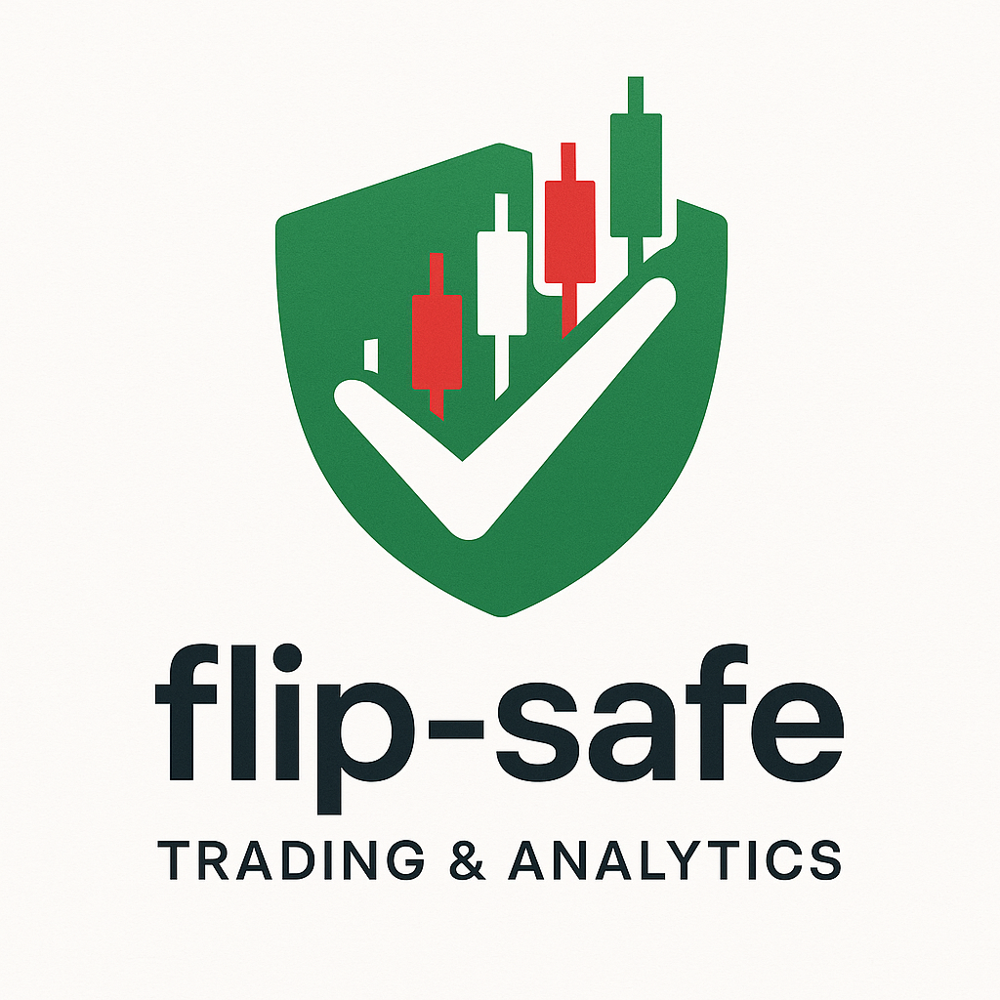

# Flip Safe - Unified Trading Platform



Flip Safe is a comprehensive trading and analytics platform built with Next.js. It provides real-time market data, advanced trading features, and powerful analytics tools in a single, unified interface.

## Features

### Trading Features

-   **Real-time Market Data**: Live market data and trading capabilities.
-   **Order Management**: Place and manage buy/sell orders.
-   **Portfolio Tracking**: Keep track of your holdings, positions, and funds.
-   **Price Alerts**: Set up and receive price alerts and notifications.
-   **Advanced Trading Terminal**: A full-featured trading terminal for advanced users.

### Analytics Features

-   **Historical Data Simulation**: Simulate trading strategies with historical data.
-   **Market Data Analysis**: Tools for in-depth market data analysis.
-   **Customizable Market Watch**: Create and manage your own market watch lists.
-   **Chart Analysis**: Analyze charts with multiple timeframes and indicators.

### Unified Experience

-   **Single Application**: Both trading and analytics modes in one application.
-   **Consistent UI/UX**: Shared components for a consistent user experience.
-   **Theming**: Switch between night and day themes.
-   **Real-time Sync**: Real-time data synchronization across the platform.

## Tech Stack

-   **Framework**: [Next.js](https://nextjs.org/)
-   **Language**: [TypeScript](https://www.typescriptlang.org/)
-   **Database**: [MongoDB](https://www.mongodb.com/)
-   **Styling**: [Tailwind CSS](https://tailwindcss.com/)
-   **Charting**: [Lightweight Charts](https://www.tradingview.com/lightweight-charts/)
-   **API**: [Kite Connect](https://kite.trade/)

## Prerequisites

Before you begin, ensure you have the following installed:

-   [Node.js](https://nodejs.org/) (v18.0.0 or higher)
-   [npm](https://www.npmjs.com/) or [yarn](https://yarnpkg.com/)
-   [MongoDB](https://www.mongodb.com/try/download/community) (running locally or a remote connection string)

## Getting Started

Follow these steps to get the project up and running on your local machine.

### 1. Clone the Repository

```bash
git clone <repository-url>
cd flip-safe
```

### 2. Install Dependencies

```bash
npm install
```

### 3. Configure Environment Variables

Create a `.env.local` file in the root of the project and add the following environment variables. You can use the `.env.example` file as a reference.

```
# Database
MONGODB_URI=mongodb://localhost/zdb

# Kite Connect API
KITE_API_KEY=your_kite_api_key_here
KITE_API_SECRET=your_kite_api_secret_here

# Next.js
NEXT_PUBLIC_CLIENT_URL=http://localhost:3000
NEXT_PUBLIC_API_URL=http://localhost:3000

# Node Environment
NODE_ENV=development
```

### 4. Run the Application

Start the development server:

```bash
npm run dev
```

The application will be available at [http://localhost:3000](http://localhost:3000).

## Available Scripts

Here are some of the most important scripts available in the `package.json`:

-   `npm run dev`: Starts the application in development mode.
-   `npm run build`: Creates a production build of the application.
-   `npm run start`: Starts the application in production mode.
-   `npm run lint`: Lints the codebase for potential errors.
-   `npm run format`: Formats the code using Prettier.

## Project Structure

The project is organized as a standard Next.js application:

-   `src/app/`: Contains the main application pages and API routes.
-   `src/components/`: Contains shared React components.
-   `src/lib/`: Contains utility functions and library initializations.
-   `public/`: Contains static assets like images and fonts.

## API Endpoints

The API is built with Next.js API Routes and is available under the `/api` path. Here are some of the main endpoints:

-   `/api/auth/*`: Authentication related endpoints.
-   `/api/kc/*`: Kite Connect integration endpoints.
-   `/api/orders/*`: Order management endpoints.
-   `/api/db/*`: Database related endpoints.
-   `/api/binance/*`: Binance integration endpoints.
